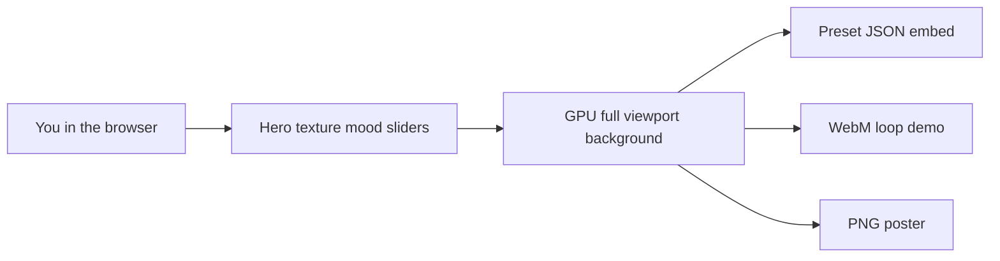

# Background Studio

> **One-line summary:** Design **animated hero backgrounds for portfolios and landing pages** in the browser — export **preset JSON** for your site, **WebM loops** for demos, and **PNG posters** for fallbacks. Powered by *The Algorithm Engine*, a single-pass WebGL compositor (personal / learning project).

---

## Architecture diagram

**Simple picture of the flow**

**Optional:** open [mermaid.live](https://mermaid.live) and paste the block above if you want a PNG for slides.

---

## What problem this solves

**Background Studio** is a **small, self-contained web app** for a common landing-page need: **ambient, performant animated backgrounds** without baking video or round-tripping through desktop compositing software.

1. Optionally bring in a **hero texture** (brand photo, grain plate, or graphic) as the sampled backdrop.
2. Optionally add an **overlay** (logo/decal) and **preview text** for layout (production sites use HTML above the canvas).
3. **Twist the look** in real time—color, grain, scan lines, warping-style motion, and similar parametric ideas—then export **JSON you can embed on a real site**.

---

## How it works

1. **You open the page** — The **background fills the window**. On **`/lab`** (Background Studio), controls sit in a **side panel** that opens **by default**; dismiss via **Close** / **Hide** or reopen with the **Studio** button (hover the **right edge** on larger screens).
2. **You choose images** — Hero texture and overlay are **separate slots**. You can **remove** either one without touching the other.
3. **You tune the look** — Sliders and toggles update **one shared scene**; the app remembers texture placement (drag on the canvas moves the overlay or the selected preview text, depending on the tab).
4. **Presets and reset** — **Background looks** in the Look section apply saved looks (shader + preview type settings) while **usually keeping your uploads**. **Reset look** puts effects and preview text back to a **clean default** without deleting your images unless you clear them yourself.
5. **Export** — **Preset JSON first** (primary deliverable for embed), then **WebM loop** or **PNG poster** from the panel export footer when you like the frame.

---

## Routes & product surfaces

This repo ships **one deploy, three routes** on the same WebGL engine. A separate personal portfolio website is **deferred** — **Background Studio** (*The Algorithm Engine*) is the public project you run and ship from this repository.

| Route | Surface | Status |
|-------|---------|--------|
| **`/`** | **Living demo** — full-viewport animated hero (demo hero texture + preset on mount, preview text, motion). Level 2 mood: keywords + optional AI patch director. | Level 2 shipped |
| **`/lab`** | **Background Studio** — Source / Look / Tune / Export / Advanced panel: upload, background looks, mood, semantic sliders, exports; Advanced holds full layer editor. Panel opens by default on `/lab`. | Phase C IA shipped |
| **`/story`** | **Case study** — Background Studio embed narrative (HTML above canvas, preset JSON, exports). Links to [`PORTING.md`](src/lib/preset/PORTING.md) embed guide. | Shipped (Phase F) |

All routes share **one shader**, **one Zustand store**, and **one canvas component** — no duplicated GPU logic.

---

## Architecture at a glance

| Part | Role in plain terms |
|------|---------------------|
| **Main canvas** | Full-viewport **background layer** for your site — always meant to use the **full window** |
| **Control drawer** | Slides in from the right; doesn’t shrink the canvas permanently |
| **Store** | Keeps textures, preview text layers, effect knobs, and which tab is active |
| **Shader** | One main drawing program on the GPU that composites hero texture → overlay → preview text |
| **Presets** | JSON you can copy, download, or import; can optionally embed images — **primary export** |
| **Production pattern** | Canvas behind HTML content; GPU text in the lab is preview only |

---

## Tech stack

* **App:** React, TypeScript, Vite (how the site is built and run locally).
* **Graphics:** Three.js with React Three Fiber (the **3D layer** is really a **single flat rectangle** filling the view).
* **Styling:** Tailwind CSS.
* **State:** Zustand (one central place for “what the background knows right now”).

**Skills this repo exercises**

* **GPU-side composition** — one draw, many layers of logic in the fragment shader.
* **Image handling** — hero texture uploads, optional removal, aspect-aware display so plates don’t stretch oddly.
* **Preset round-trip** — save and reload a structured snapshot of the look (and optionally the images inside the file).
* **Export** — preset JSON (embed), still frames, and a simple video capture path from the canvas.

---

## What can connect today

* **You**, in a **modern desktop or mobile browser** — no server required for the core experience.
* **A larger portfolio or landing site** — export preset JSON from Background Studio, port the shader stack per [`PORTING.md`](src/lib/preset/PORTING.md) (layout snippet + load sequence), and place the canvas behind your HTML content.
* **Files on your machine** — hero textures in; **preset JSON** (primary), WebM loop, PNG poster out.

There is **no hosted “API product”** here; it’s a front-end experience you run or ship as static files after `npm run build`.

---

## Tests

* **Vitest** (`npm test`) covers the preset contract: catalog validation (`validatePresetV2`), patch merge/apply (`mergeLayerEffectsPatch`, `applyPresetPatch`), mood keyword map (`mapMoodToPreset`), AI mood parser/prompt (`parseAiMoodResponse`, `buildAiMoodSystemPrompt`), and semantic slider → patch mapping (`semanticSlidersToPatch`).
* Also run **`npm run lint`** and **`npm run build`** before you rely on a build.

---

## Keeping this file accurate as the repo changes

Treat **PROJECT.md** as the **story and scope** file. When behavior shifts, update the matching section here and put **step-by-step or file-level detail** in [README.md](README.md).

1. **Inbound** — What users can upload and what presets can carry (images optional inside JSON).
2. **The canvas** — Full-screen behavior and how controls hide (drawer / hover / menus).
3. **Outbound** — preset JSON (primary), WebM loop, PNG poster.

---

## Why even?

I wanted a **single, eye-catching demo** that shows I can **think in layers**, **keep state understandable**, and **let the GPU do the heavy lifting**—without hiding behind a black box tool. **Background Studio** was a practical way to practice **shaders**, **composition order**, and **embeddable preset export**, as something I can **link from a portfolio** or walk through in an interview.

---

## Current state (what works today)

**Documented behavior of this repo:**

* **Local dev:** `npm run dev`; **production build:** `npm run build`.
* **Client routing** — **`/`** auto-loads the living demo (demo hero texture + preset) and accepts **mood** input (optional AI director with keyword fallback; catalog preset + optional patch; hero texture unchanged); **`/?preset=<id>`** applies a catalog look after hero init (style only; hero texture stays). **`/lab`** (Background Studio) opens the panel **by default** with **Source / Look / Tune / Export / Advanced** sections (formula glossary under Tune; full layer editor in collapsed Advanced); **`/lab?preset=<id>`** applies a catalog look on mount. **`/story`** is a scrollable embed case study (HTML above canvas, presets, exports) with links back to **`/`** and **`/lab`**. Phased plan complete through **Phase 10** (share URLs, SEO meta, launch checklist). **Phase 11a:** effects-only preset apply with **Keep preview text** toggle (default on) for background looks, mood, and URL presets. **Phase 6b:** formula glossary in Background Studio via [`formulaCatalog.ts`](src/data/formulaCatalog.ts). **Phase A:** docs reframe to Background Studio (this file, README, MATH, index meta). **Phase C:** panel IA restructure. **Phase F:** Story + PORTING embed narrative.
* **Hero texture + optional overlay + preview text** with drag placement rules described in the README. Production sites use HTML above the canvas.
* **Background looks** gallery with **14 bundled presets** (7 featured ambient + 7 legacy under **More looks**); **Keep preview text** toggle (default on) applies grade without replacing your preview copy; **Reset look** for defaults **without** clearing uploads by default.
* **Remove** on each upload row to clear **only** that slot.
* **Preset** copy / download / import (primary export); **WebM loop** and **PNG poster** from the panel export footer. JSON export works without upload; PNG/WebM require hero texture.

**Known limits (honest)**

* **Shared store across routes** — visiting **`/`** after **`/lab`** resets the canvas to the landing hero (lab uploads are not preserved when you return home).
* **One main shader path** — fancy multi-pass pipelines (bloom chains, depth, etc.) are out of scope unless you extend the project.
* **Browser and GPU dependent** — very old devices or strict WebGL limits may behave differently; export quality depends on the browser’s recorder where relevant.
* **English-first UI**; no i18n layer.

---

## What was new?

* Treating **hero texture, overlay, and preview text** as **separate “looks”** in one shader while still drawing **once** per frame.
* **Preset files** that can travel with or without embedded images, plus **hydration** that doesn’t always wipe your uploads when you’re just trying a style.
* **Full-viewport** presentation with controls as an **overlay** so the background reads well **embedded behind HTML on a portfolio or landing page**.

---

## Future roadmap

Post-launch ideas — not commitments. See [README.md](README.md) for technical detail.

* **Phase B** — Lab discoverability (open panel, export tooltips).
* **Phase C** — IA: Source / Look / Tune / Export / Advanced.
* **Phase D** — UI layer label renames.
* **Phase E** — Ambient preset catalog expansion (featured vs legacy, 4 new site-safe presets, mood retune). **Done.**
* **Phase F** — Story + PORTING embed narrative. **Done.**
* **Phase G** — Safe zone / reduced motion (deferred).
* **Sound-reactive** parameters and richer export options (codec choice, duration UX).

---

## Links

* **Operator / technical docs:** [README.md](README.md)

---
