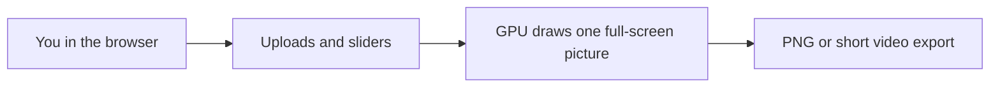

# The Algorithm Engine

> **One-line summary:** A **browser-based** image playground where you layer a **background**, an optional **sticker (decal)**, and **text**, then paint everything with **live visual effects** on the graphics card—good for a **portfolio demo** of how one full-screen canvas can stay fast and expressive (personal / learning project).

---

## Architecture diagram

**Simple picture of the flow**

**Optional:** open [mermaid.live](https://mermaid.live) and paste the block above if you want a PNG for slides.

---

## What problem this solves

**The Algorithm Engine** is a **small, self-contained web app** that lets you:

1. Bring in a **photo or graphic** as the backdrop.
2. Optionally add a **decal** and **type on top** (several text layers if you want).
3. **Twist the look** in real time—color, grain, scan lines, warping-style motion, and similar “synth” ideas—without round-tripping through desktop compositing software.

---

## How it works

1. **You open the page** — The **picture fills the window**. Controls sit in a **side panel** you open from the corner or by hovering the **right edge** on larger screens; **Ideas** opens from a small menu on the left for quick looks.
2. **You choose images** — Background and decal are **separate slots**. You can **remove** either one without touching the other.
3. **You tune the stack** — Sliders and toggles update **one shared scene**; the app remembers texture placement (drag on the canvas moves the decal or the selected text, depending on the tab).
4. **Presets and reset** — **Ideas** applies saved “looks” (shader + type settings) while **usually keeping your uploads**. **Reset look** puts effects and text back to a **clean default** without deleting your images unless you clear them yourself.
5. **Export** — You can grab a **PNG** or a **short looping video** from the stack panel when you like the frame.

---

## Routes & product surfaces

This repo is evolving toward **one deploy, three routes** on the same WebGL engine. A separate personal portfolio website is **deferred** — **The Algorithm Engine** is the public project you run and ship from this repository.

| Route | Surface | Status |
|-------|---------|--------|
| **`/`** | **Landing** — full-viewport living hero (demo image + preset on mount, GPU text, motion). Level 2 mood/AI planned. | Level 1 shipped |
| **`/lab`** | **Lab** — the full editor today: Ideas menu, Stack drawer, uploads, presets, PNG/WebM export, canvas drag. | Built in Phase 1 |
| **`/story`** | **Case study** — static explainer page for how the engine works (architecture, math, presets). | Documented now; UI in a later phase |

All routes share **one shader**, **one Zustand store**, and **one canvas component** — no duplicated GPU logic.

---

## Architecture at a glance

| Part | Role in plain terms |
|------|---------------------|
| **Main canvas** | The big WebGL view; always meant to use the **full window** |
| **Control drawer** | Slides in from the right; doesn’t shrink the canvas permanently |
| **Store** | Keeps textures, text layers, effect knobs, and which tab is active |
| **Shader** | One main drawing program on the GPU that composites background → decal → text |
| **Presets** | JSON you can copy, download, or import; can optionally embed images |

---

## Stack

* **App:** React, TypeScript, Vite (how the site is built and run locally).
* **Graphics:** Three.js with React Three Fiber (the **3D layer** is really a **single flat rectangle** filling the view).
* **Styling:** Tailwind CSS.
* **State:** Zustand (one central place for “what the picture knows right now”).

**Skills this repo exercises**

* **GPU-side composition** — one draw, many layers of logic in the fragment shader.
* **Image handling** — uploads, optional removal, aspect-aware display so photos don’t stretch oddly.
* **Preset round-trip** — save and reload a structured snapshot of the look (and optionally the images inside the file).
* **Export** — still frames and a simple video capture path from the canvas.

---

## What can connect today

* **You**, in a **modern desktop or mobile browser** — no server required for the core experience.
* **A larger portfolio site** — the canvas is tagged so exports still find the right surface if you embed the app next to other content.
* **Files on your machine** — images in, PNG / WebM / JSON preset out.

There is **no hosted “API product”** here; it’s a front-end experience you run or ship as static files after `npm run build`.

---

## Tests

* **No automated test suite** ships in this repo today—quality is **manual try-it** (upload, preset, export) plus **`npm run lint`** and **`npm run build`** before you rely on a build.

---

## Keeping this file accurate as the repo changes

Treat **PROJECT.md** as the **story and scope** file. When behavior shifts, update the matching section here and put **step-by-step or file-level detail** in [README.md](README.md).

1. **Inbound** — What users can upload and what presets can carry (images optional inside JSON).
2. **The canvas** — Full-screen behavior and how controls hide (drawer / hover / menus).
3. **Outbound** — PNG, WebM, and preset JSON.

---

## Why even?

I wanted a **single, eye-catching demo** that shows I can **think in layers**, **keep state understandable**, and **let the GPU do the heavy lifting**—without hiding behind a black box tool. This project was a practical way to practice **shaders**, **composition order**, and **export**, as something I can **link from a portfolio** or walk through in an interview.

---

## Current state (what works today)

**Documented behavior of this repo:**

* **Local dev:** `npm run dev`; **production build:** `npm run build`.
* **Client routing** — **`/`** auto-loads the landing hero (demo image + preset); **`/lab`** is the full editor; **`/story`** remains documented only until a later phase.
* **Background + optional decal + text** with drag placement rules described in the README.
* **Ideas** gallery for one-click looks; **Reset look** for defaults **without** clearing uploads by default.
* **Remove** on each upload row to clear **only** that slot.
* **Preset** copy / download / import; exports **PNG** and **loop WebM** from the stack footer.

**Known limits (honest)**

* **Shared store across routes** — visiting **`/`** after **`/lab`** resets the canvas to the landing hero (lab uploads are not preserved when you return home).
* **One main shader path** — fancy multi-pass pipelines (bloom chains, depth, etc.) are out of scope unless you extend the project.
* **Browser and GPU dependent** — very old devices or strict WebGL limits may behave differently; export quality depends on the browser’s recorder where relevant.
* **English-first UI**; no i18n layer.

---

## What was new?

* Treating **background, decal, and text** as **separate “looks”** in one shader while still drawing **once** per frame.
* **Preset files** that can travel with or without embedded images, plus **hydration** that doesn’t always wipe your uploads when you’re just trying a style.
* **Full-viewport** presentation with controls as an **overlay** so the piece reads well **embedded in a portfolio**.

---

## Future roadmap

Directional phases—not commitments. See [README.md](README.md) for technical detail.

* **Landing polish** — hero preset on `/`, Level 2 mood/AI, richer minimal chrome.
* **`/story` case study** — static explainer for interviews and portfolio visitors.
* **Preset library expansion** — more bundled looks and gallery UX.
* **Sound-reactive** parameters and richer export options (codec choice, duration UX).
* **Automated tests** for preset validation or snapshot checks.

---

## Links

* **Operator / technical docs:** [README.md](README.md)

---
