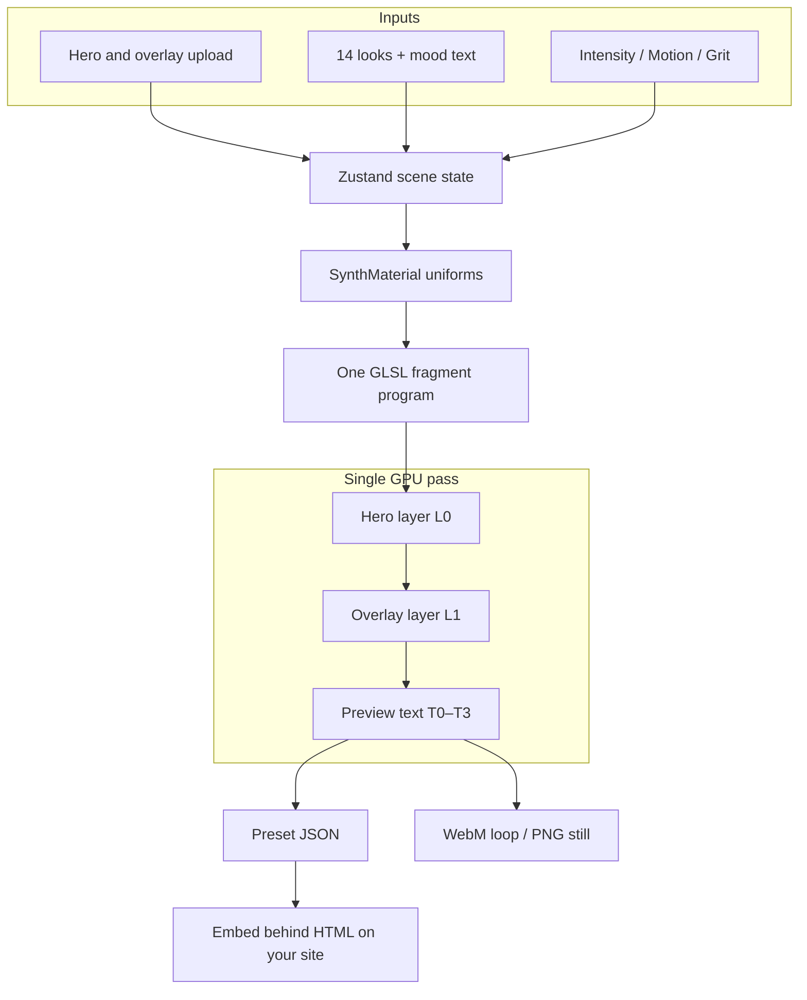

# Architecture — Background Studio

## Premise

**Background Studio** (*The Algorithm Engine*) is a browser-only live background designer. It targets a practical landing-page need: ambient, animated full-viewport hero backgrounds without baking video or round-tripping through desktop compositors. Users optionally upload a hero texture and overlay, tune parametric looks in real time, and export **preset JSON** (primary) for embedding on production sites, plus **WebM loops** and **PNG posters** for demos and fallbacks.

## Goals and non-goals

**Goals**

- Design site-safe animated heroes that read well behind HTML content.
- Keep the GPU path minimal: one full-screen quad, one `ShaderMaterial`, one fragment program.
- Ship an embeddable **coefficient contract** (preset v2) so looks travel without re-authoring in a DCC tool.
- Support lab preview of overlay and up to four text slots without forcing GPU text on production pages.

**Non-goals**

- Multi-pass bloom / depth / post stacks.
- A hosted “API product” beyond optional mood AI (`/api/mood`).
- Replacing HTML typography on production sites with shader text.
- Audio-reactive parameters or reduced-motion export helpers (deferred; see README).

## Unique approach

- **Per-layer effect banks in one draw.** Hero, overlay, and preview text each get their own warp/shade uniforms (`L0` / `L1` / `T0–T3`) while compositing in a single fragment pass—not a framebuffer chain.
- **Presets are inputs, not pixels.** JSON stores numbers, transforms, optional base64 assets, and `baseTimeSeconds`. Replaying a look means hydrating Zustand and pushing uniforms—the same shader runs again.
- **Apply modes instead of one “load preset”.** Effects-only (regrade, keep preview text), style (full look), full stack import (may embed images), and runtime patches for mood/AI/semantic sliders.
- **Semantic knobs.** Intensity / Motion / Grit map through linear ranges onto background-layer shader fields so Tune stays approachable without exposing every uniform.
- **Mood as catalog + optional patch.** Keywords always map to a catalog look; optional AI returns `{ basePresetId, patch? }` validated server-side, with keyword fallback on any failure.
- **Export clock hijack.** WebM capture writes `window.__SYNTH_EXPORT_TIME__` so each layer’s `u_*_t` follows a deterministic timeline, then clears it so live preview returns to the R3F clock.

## System overview

Diagram source (portfolio + GitHub): [`docs/architecture.mmd`](architecture.mmd).



**Routes (one deploy, shared engine):** `/` living demo, `/lab` Background Studio panel, `/story` embed case study. Unknown paths redirect home.

## Key components

| Piece | Role |
|-------|------|
| `src/shells/*` | Route shells: landing, lab drawer, story narrative |
| `src/store/useSynthStore.ts` | Textures, global synth params, layer effect maps, UI tabs |
| `src/webgl/SynthCanvas.tsx` | R3F scene: orthographic camera, one `planeGeometry(2,2)` mesh |
| `src/webgl/materials/SynthMaterial.tsx` | Seeds/updates uniforms each frame from store `getState()` |
| `src/webgl/shaders/fragment.glsl` | Warp → sample → shade → alpha-composite stack |
| `src/lib/preset/*` | Build, validate, hydrate, apply (v1 + v2), share URLs |
| `src/lib/mood/*` + `api/mood.ts` | Keyword mood; optional OpenAI director on Vercel |
| `src/lib/semantic/mapSemanticSliders.ts` | Intensity / Motion / Grit → `PresetPatch` |
| `src/lib/export/*` | PNG poster + WebM loop from the WebGL canvas |
| `src/data/presetCatalog.ts` | 14 style looks (7 featured ambient + 7 legacy) |

GPU math glossary: [`MATH.md`](../MATH.md). Embed guide: [`src/lib/preset/PORTING.md`](../src/lib/preset/PORTING.md).

## Data / control flow

1. **Upload** — Hero → `TextureLoader` → `setImageTexture`. Overlay → `createProcessedDecalTexture` → `setDecalTexture`.
2. **Authoring** — Catalog / mood / URL `?preset=` / semantic sliders / Advanced layer controls write Zustand (`layerEffects`, `textLayers`, transforms).
3. **Render** — `useFrame` copies store → uniforms (including per-layer `baseTime * timeScale`). Preview text is rasterized to `CanvasTexture`s when layers or viewport change.
4. **Shader** — Contain-letterbox UVs for the hero; `layerWarp` then `layerShade` per prefix; overlay alpha-over or optional luminance-mask blend; text slots bottom-to-top.
5. **Export** — `buildPreset` / clipboard / download for JSON; `exportLoopWebm` / `exportCanvasPng` for media (PNG/WebM require a hero texture).

## Notable implementation details

- **Contain math in GLSL** — `u_resolution` × `u_imageResolution` letterboxes the hero like CSS `object-fit: contain`.
- **Melt is UV warp, not blur** — `spaceDistortionFor` offsets sample coordinates; shade ops (bleed, posterize, duotone, halftone, scanlines, grain) run on already-sampled RGB.
- **Link flags** — `linkDecalToMath` / `linkTextToMath` can share the background’s warped UV grid with overlay/text.
- **Keep preview text** — Persisted preference; catalog/mood/URL applies default to effects-only so regrading a hero doesn’t wipe lab copy.
- **Fallback textures** — 1×1 DataTextures avoid invalid samplers when slots are empty.
- **`preserveDrawingBuffer: true`** — Required for PNG capture from the canvas.
- **SPA hosting** — `vercel.json` + `public/_redirects` rewrite client routes; `/api/*` reserved for mood on Vercel.

## Tradeoffs and limitations

- Complexity lives in **one large fragment shader** with duplicated uniform banks—easier embed story, harder to add true multi-pass effects.
- Export helpers query `document.querySelector("canvas")` — brittle if a second canvas appears.
- Shared Zustand across routes: returning to `/` after `/lab` re-inits the landing hero (lab uploads are not preserved).
- Core experience is static/client-only; AI mood needs Vercel + `OPENAI_API_KEY` and a build-time `VITE_MOOD_AI_ENABLED=true`.
- Quality depends on device WebGL and browser `MediaRecorder` behavior.

## How to verify locally

See [README.md](../README.md) for install, env, and scripts.

```bash
npm install
npm run dev          # Vite
npm test && npm run lint && npm run build
```

Smoke: `/` mood + hero, `/lab?preset=archive` studio + exports, `/story` case study. Optional AI: `vercel dev` + Vite proxy per README `.env.example`.
